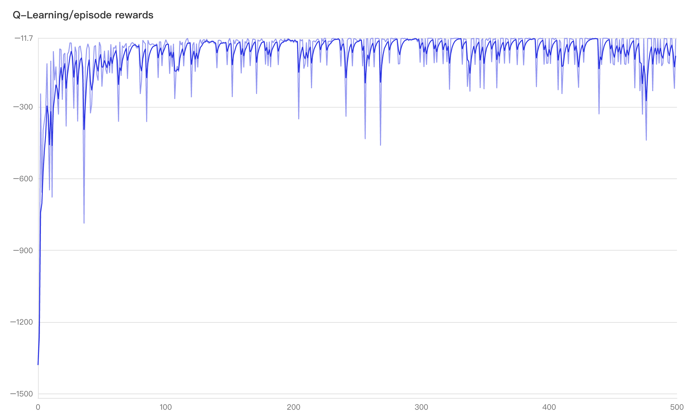

# EasyRL task2 笔记

### 项目一代码
[Q-Learning train.py 提交记录](https://github.com/HeGanjie/easyrl-exercises/commit/9a86669610f875c81f3ae99cedc6770c825e3e32)  
[项目地址](https://github.com/HeGanjie/easyrl-exercises)

### 项目一/q_learning/train.py 运行结果
```
...
Episode 495: steps = 13 , reward = -13.0
Episode 496: steps = 15 , reward = -15.0
Episode 497: steps = 25 , reward = -124.0
Episode 498: steps = 26 , reward = -224.0
Episode 499: steps = 15 , reward = -15.0
test reward = -13.0
```

### visualdl 截图


### 做项目过程中遇到的坑
1. 因为家里电脑是 windows，怕用 python 会产生问题，所以一开始尝试用 colab，后面发现 env.render 是输出文本的，无法录制视频，折腾了一晚上，放弃了;
2. 后面使用工作电脑 mac，装上了 pycharm，然后安装依赖，报错，python 从 3.9 降级到 3.7 才行
3. 运行 Sarsa train.py 的时候，训练应该是成功了，看效果的时候小乌龟在反复横跳 XD  
  看书里描述，可能是因为采用的是 𝜀-贪心 算法，策略会不断改变（𝜀 值会不断变小），所以策略不稳定。

### 简单总结

1. 这次的 Sarsa 和 Q-Learning 都用到了一步时序差分（one-step TD） 
* 时序差分: 是介于蒙特卡洛和动态规划之间的方法；免模型，不需要马尔可夫决策过程的转移矩阵和奖励函数；
  此外，时序差分方法可以从不完整的回合中学习，并且结合了自举的思想。
* 动态规划：有模型，用贝尔曼期望方程来更新状态价值；需要更新所有的状态，状态很多的时候（比如100万个、200万个），使用动态规划方法进行迭代会非常慢
* 蒙特卡洛：大数定律的思想；免模型；比动态规划快（只更新一条轨迹），必须等游戏结束时才可以学习；也适用在不是马尔可夫性质的环境下；
* 自举：是指更新时使用了估计：每走一步更新一次 Q 表格，用下一个状态的 Q 值来更新当前状态的 Q 值；
* 有模型：使用概率函数 P(s',r|s,a) 和奖励函数 R(s,a) 来描述环境，则马尔可夫决策过程已知，再通过策略迭代和价值迭代来找最佳的策略；
* 免模型：更适用于模型未知或模型很大的情况；但是需要采集更多轨迹数据来改进策略
2. Sarsa 是同策略时序差分控制，Q学习 是异策略时序差分控制
* 区别：比较一下 Q学习 和 Sarsa 的更新公式，就可以发现 Sarsa 并没有选取最大值的最大化操作。
  因此，Q学习是一个非常激进的方法，它希望每一步都获得最大的利益；Sarsa 则相对较为保守，它会选择一条相对安全的迭代路线。

### 问题
1. 感觉动态规划、贝尔曼期望方程，这次项目没怎么涉及到，印象不深；
